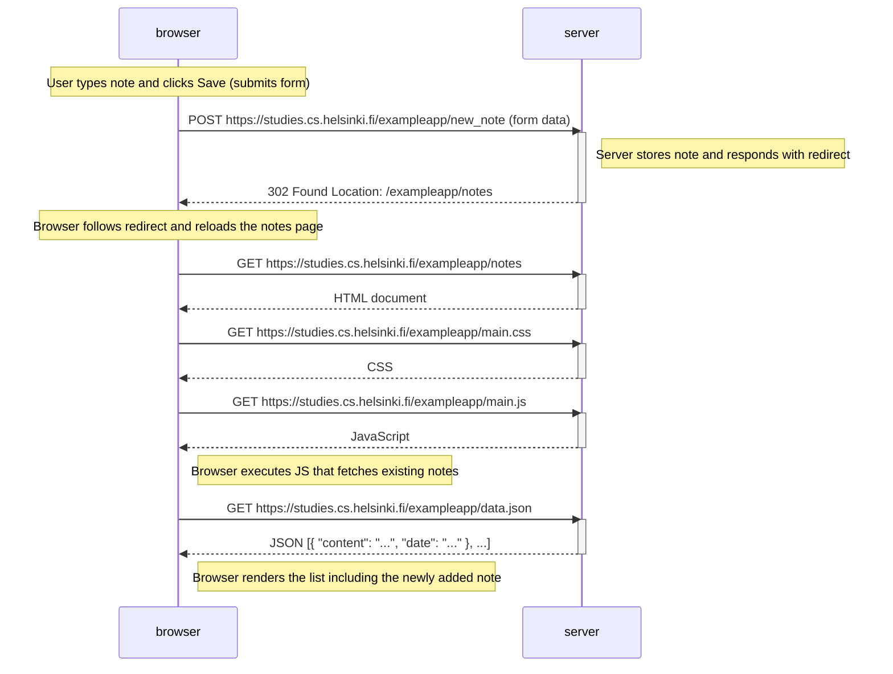

## 0.4: New note (classic app) – sequence of events

```mermaid
sequenceDiagram
    participant browser
    participant server

    Note over browser: User types note and clicks Save (submits form)
    browser->>server: POST https://studies.cs.helsinki.fi/exampleapp/new_note (form data)
    activate server
    Note right of server: Server stores note and responds with redirect
    server-->>browser: 302 Found Location: /exampleapp/notes
    deactivate server

    Note over browser: Browser follows redirect and reloads the notes page
    browser->>server: GET https://studies.cs.helsinki.fi/exampleapp/notes
    activate server
    server-->>browser: HTML document
    deactivate server

    browser->>server: GET https://studies.cs.helsinki.fi/exampleapp/main.css
    activate server
    server-->>browser: CSS
    deactivate server

    browser->>server: GET https://studies.cs.helsinki.fi/exampleapp/main.js
    activate server
    server-->>browser: JavaScript
    deactivate server

    Note right of browser: Browser executes JS that fetches existing notes
    browser->>server: GET https://studies.cs.helsinki.fi/exampleapp/data.json
    activate server
    server-->>browser: JSON [{ "content": "...", "date": "..." }, ...]
    deactivate server

    Note right of browser: Browser renders the list including the newly added note
```

