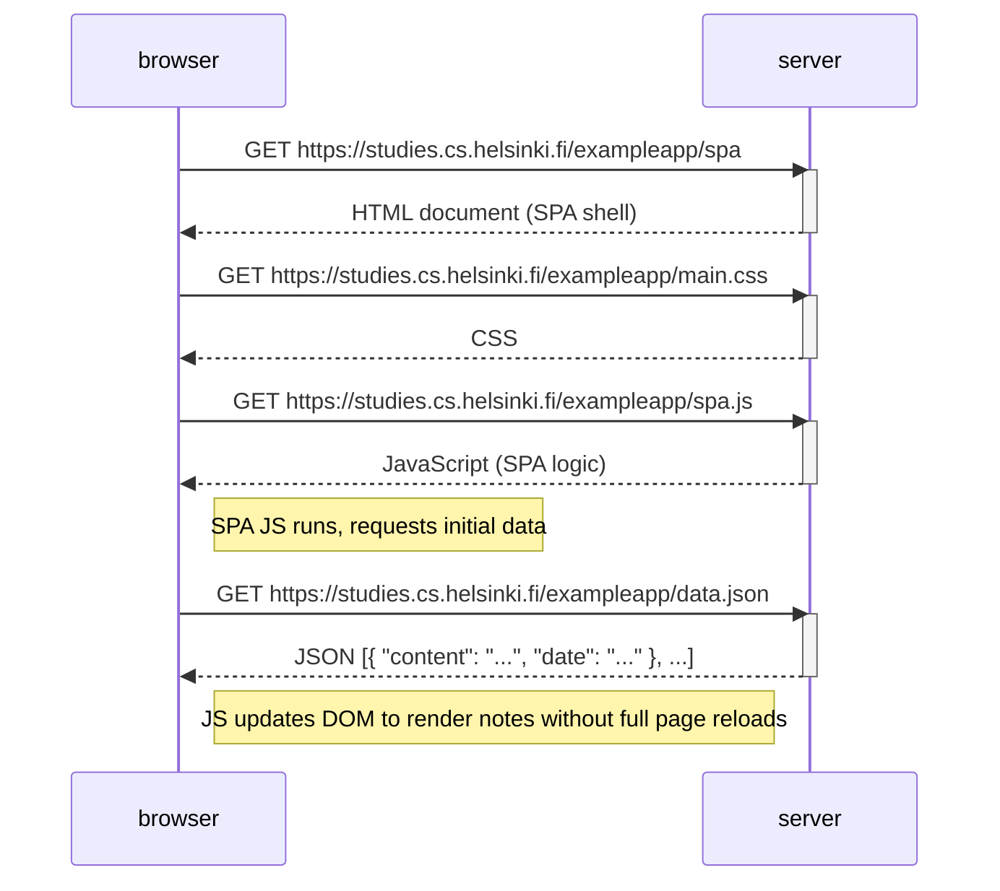

## 0.5: SPA load – sequence of events

```mermaid
sequenceDiagram
    participant browser
    participant server

    browser->>server: GET https://studies.cs.helsinki.fi/exampleapp/spa
    activate server
    server-->>browser: HTML document (SPA shell)
    deactivate server

    browser->>server: GET https://studies.cs.helsinki.fi/exampleapp/main.css
    activate server
    server-->>browser: CSS
    deactivate server

    browser->>server: GET https://studies.cs.helsinki.fi/exampleapp/spa.js
    activate server
    server-->>browser: JavaScript (SPA logic)
    deactivate server

    Note right of browser: SPA JS runs, requests initial data
    browser->>server: GET https://studies.cs.helsinki.fi/exampleapp/data.json
    activate server
    server-->>browser: JSON [{ "content": "...", "date": "..." }, ...]
    deactivate server

    Note right of browser: JS updates DOM to render notes without full page reloads
```

